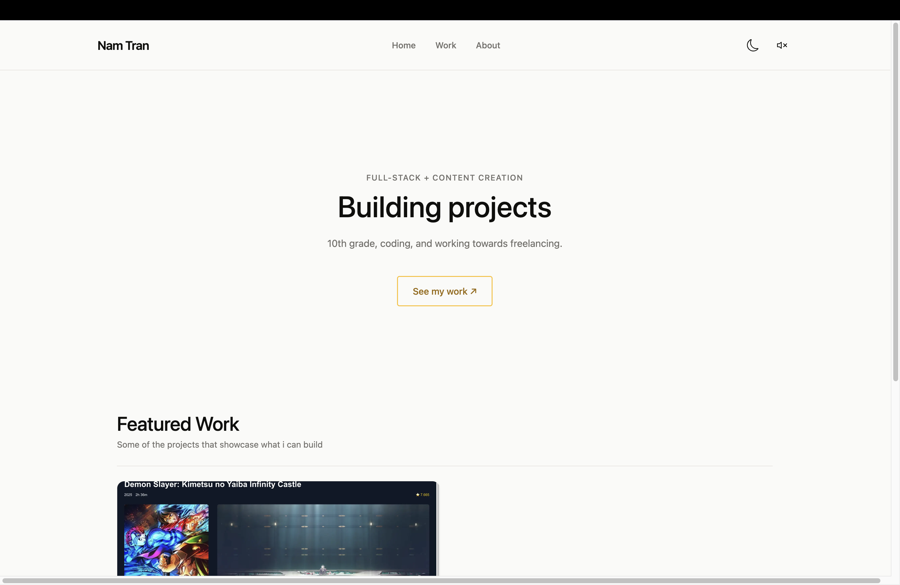
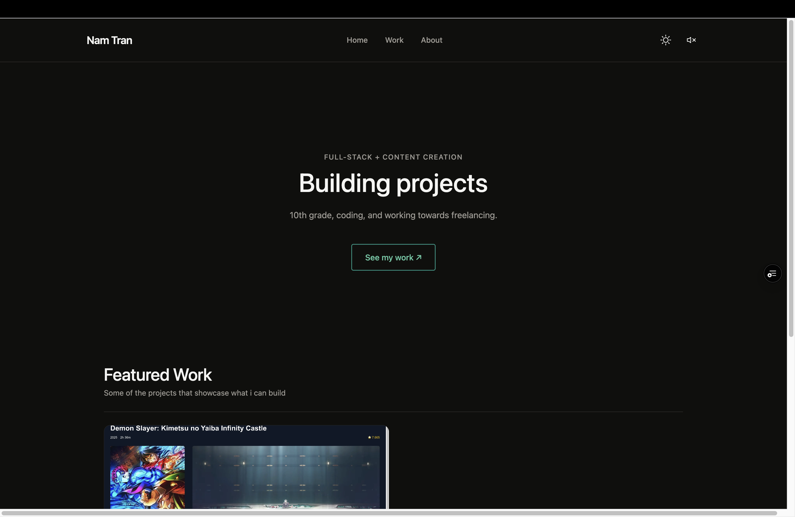
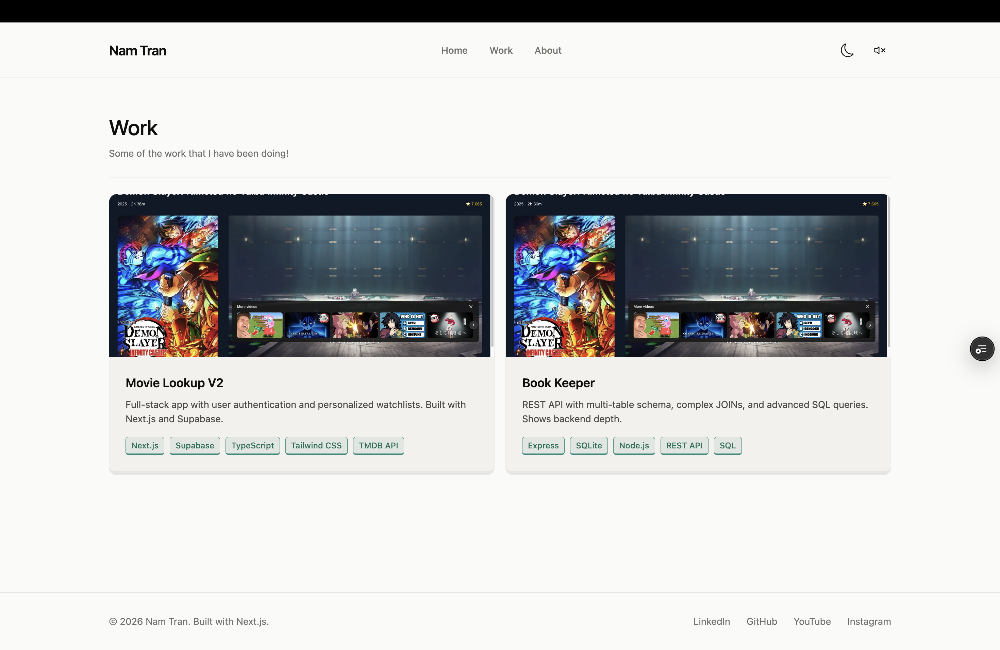
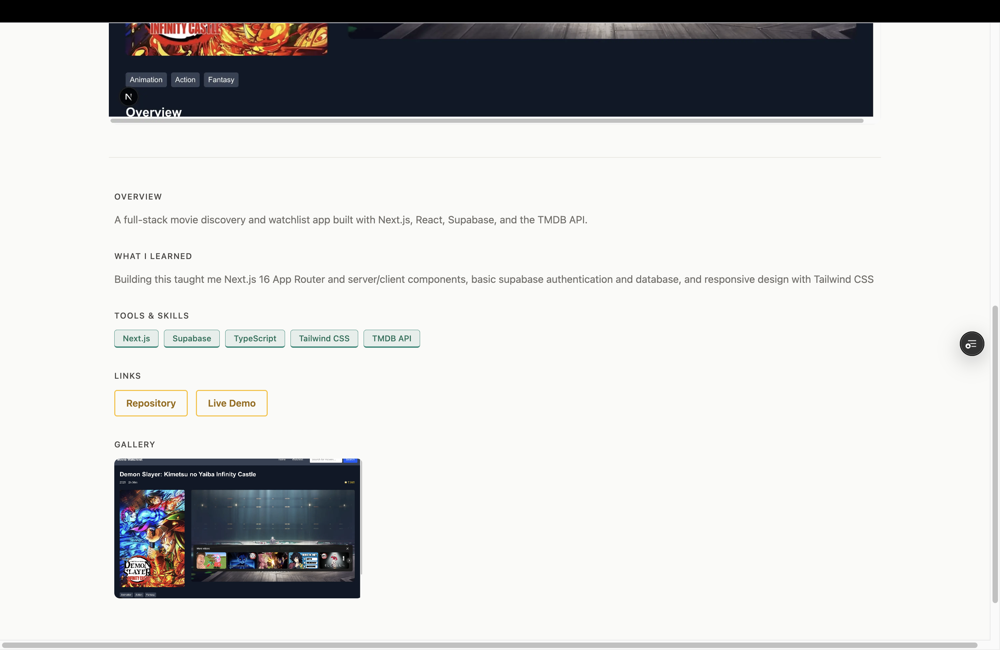

# Nam Tran — Portfolio

Personal portfolio site showcasing full-stack projects, built with Next.js 16 and deployed to Vercel.

**Live site → [namatran.com](https://namatran.com)**

---

## Tech Stack

- Next.js 16 (App Router)
- Language | TypeScript 
- Styling | Tailwind CSS v4 
- Deployment | Vercel 

## Features

- Dark / light mode — cookie-based, no flash on load
- Sound effects on interactions (toggleable)
- Project pages with image gallery and lightbox
- Sitemap + robots.txt auto-generated from project data
- 90+ / 100 / 100 / 100 Lighthouse score (Performance / Accessibility / Best Practices / SEO)

## Running Locally

```bash
git clone https://github.com/namatran/portfolio
cd portfolio
npm install
npm run dev
```

Open [http://localhost:3000](http://localhost:3000).

## Adding Projects

Projects live in `src/lib/projects.ts`. Add a new object to the `projects` array — the sitemap and work page update automatically.

```ts
{
  id: 'your-project',
  slug: 'your-project',
  featured: true,           // shows on home page
  title: 'Your Project',
  description: 'One sentence.',
  image: '/your-image.png',
  sections: [
    { label: 'Overview', content: '...' },
    { label: 'What I learned', content: '...' },
  ],
  tags: ['Next.js', 'TypeScript'],
  links: [
    { text: 'Repository', url: 'https://github.com/...' },
    { text: 'Live Demo', url: 'https://...' },
  ],
}
```

## Screenshots





